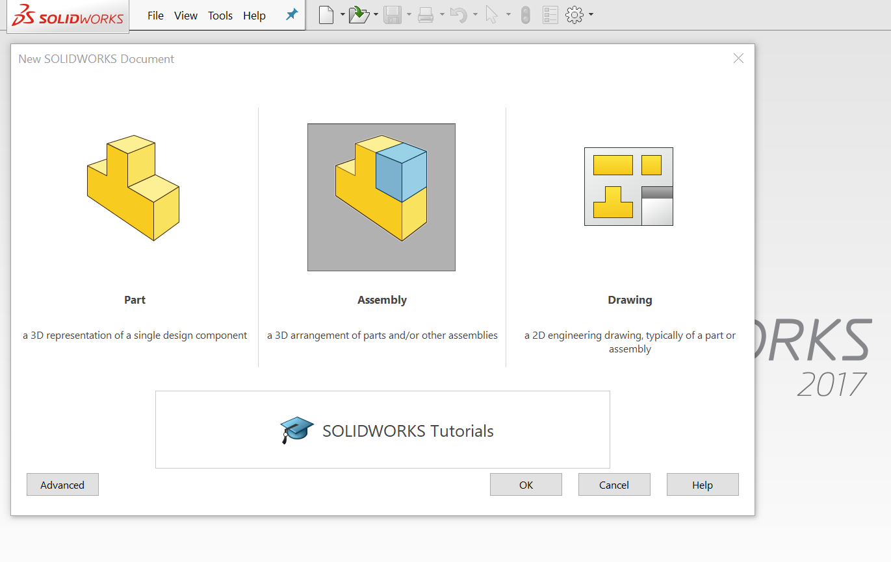
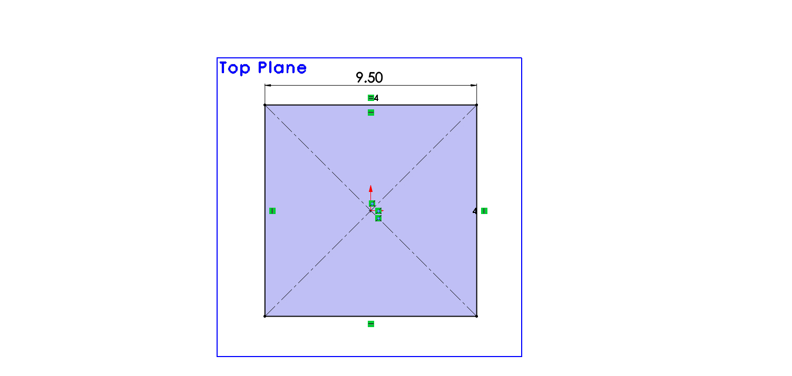
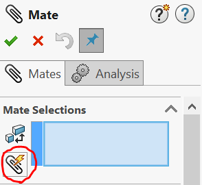
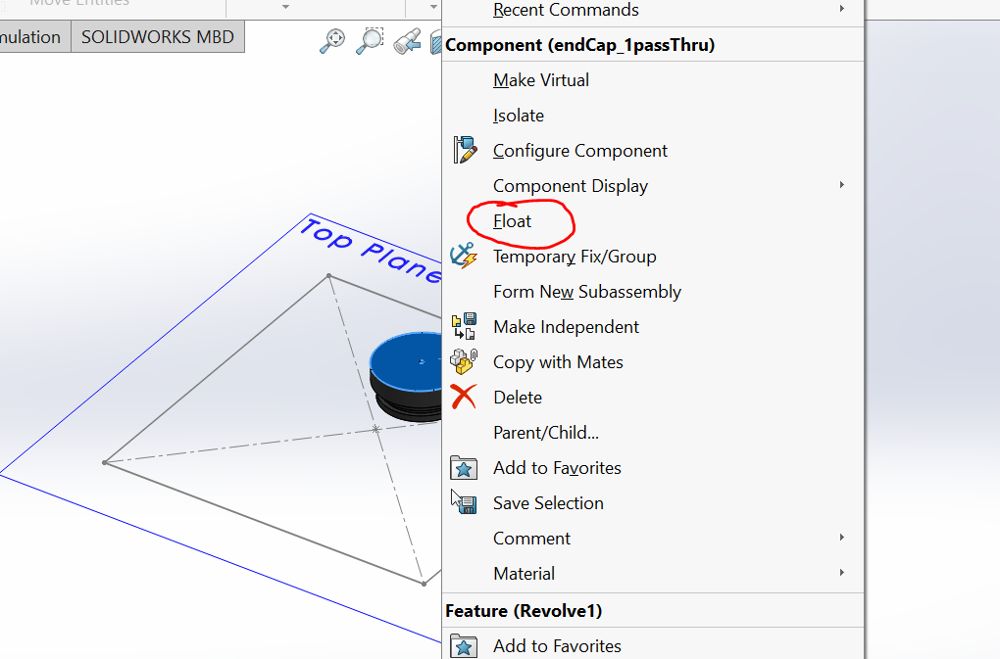
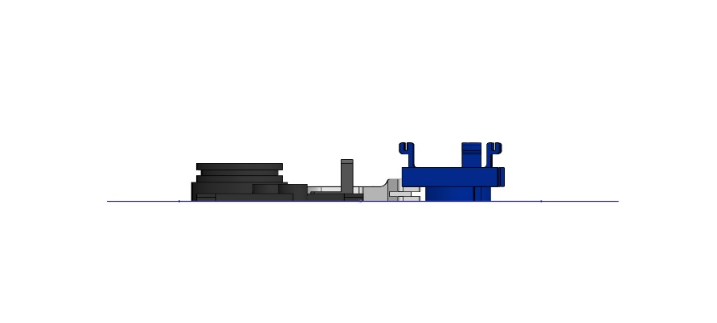
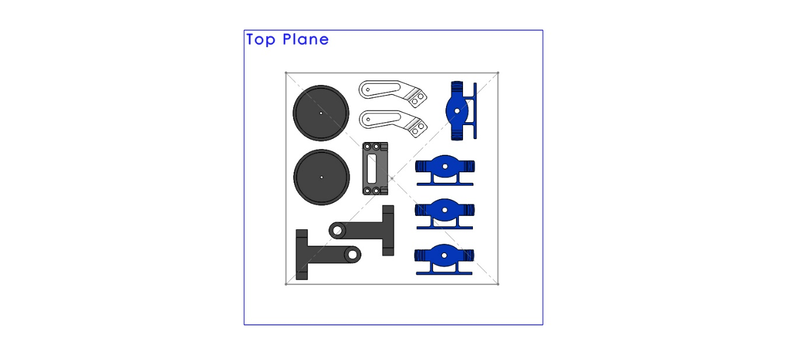
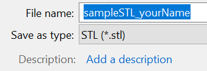

## Exporting a single STL from Solidworks
1. Create a new assembly

    

2. Sketch a square the size of the build plate on the Top Plane (Stratasys build plates are a maximum of 9.5” x 9.5”)

    

3. Add all parts you wish to print to the assembly. Mate them such that the bottom face (the first layer that will be printed) is coincident with the Top Plane. 

    *To do this quickly, use Multiple Mate Mode (the paper clip with the lightning bolt) to mate all of the faces to the Top Plane at once. Note: Sometimes the first part you add to an assembly is automatically “Fixed” and can’t be mated. To change this, right click on the part and select “Float”.*

     

4. Arrange the parts so that they are all within the build plate region and do not overlap. Allow for space between individual parts. Support material for taller parts in particular may expand beyond the outline of the part itself.

     

5. Finally, save the file as an STL document. This can now be submitted along with your print request form. 

    